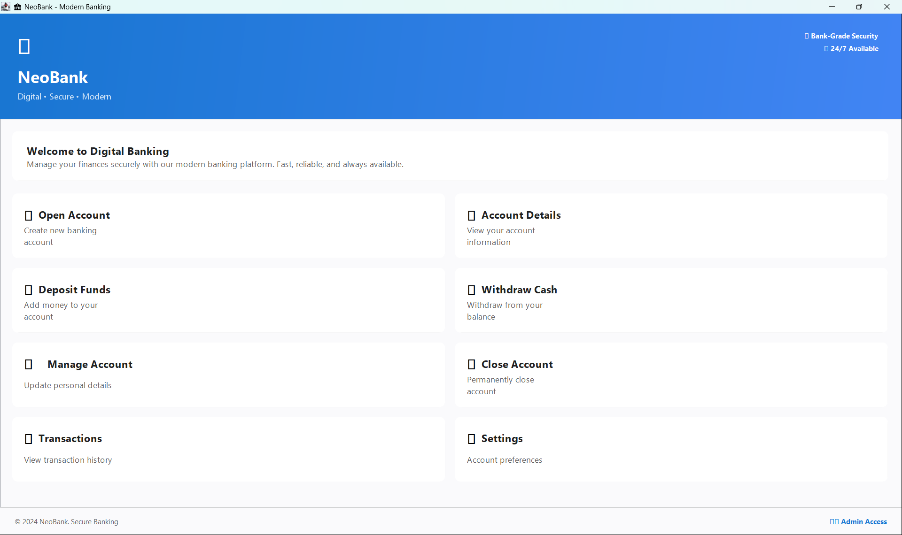
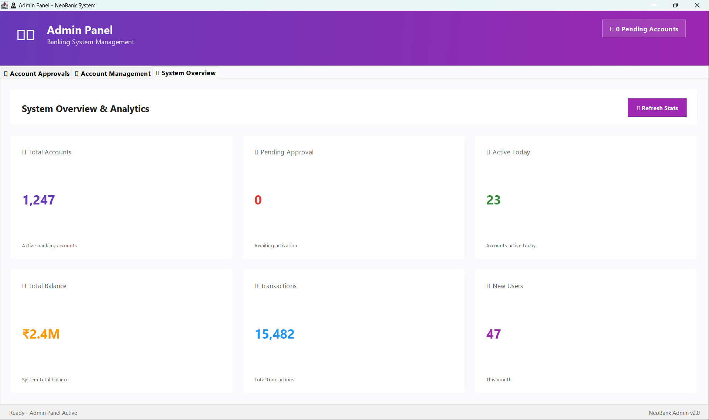
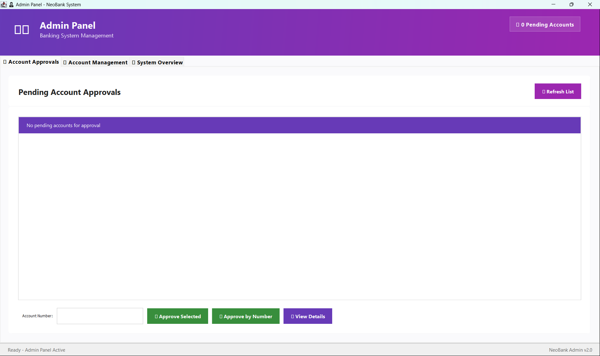
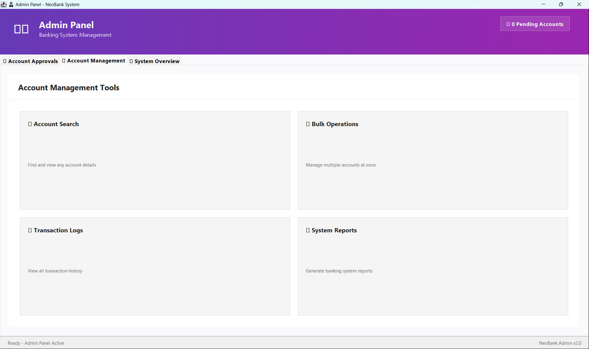

# 🏦 NeoBank - Modern Banking Management System

<div align="center">
  
  
  
  
  <br />
  <p align="center">
    <strong>An enterprise-grade Digital Banking solution with high-fidelity UI and robust administrative controls.</strong>
  </p>
</div>

---

## 📸 Visual Showcase

Experience the modern, glassmorphism-inspired interface of NeoBank.

| **Customer Dashboard** | **System Analytics & Stats** |
|:---:|:---:|
|  |  |
| **Pending Approvals Workflow** | **Account Management Suite** |
|  |  |

---

## ✨ Core Features

### 👤 Customer Experience
*   **Modern Digital Dashboard**: High-fidelity UI with real-time clock and interactive service cards.
*   **Seamless Onboarding**: Intuitive account application process with instant email confirmation.
*   **Secure Transactions**: Deposit, withdraw, and **P2P Transfers** with atomic transaction support.
*   **Enhanced Security**: 2FA via **OTP Verification** for sensitive profile updates and a secure 4-digit PIN system.
*   **Activity Tracking**: Complete, filterable transaction history with professional formatting.

### 👨‍💼 Administrative Control
*   **Centralized Command Center**: Real-time analytics dashboard monitoring total users, system liquidity, and transaction volume.
*   **Intelligent Approvals**: Streamlined workflow for reviewing and activating new account applications.
*   **Global Account Management**: Comprehensive tools to search, modify, or terminate accounts across the system.
*   **Bulk Operations**: Optimized tools for managing high-volume administrative tasks efficiently.
*   **Audit Logs**: Global visibility into every transaction occurring within the NeoBank ecosystem.

---

## 🏗️ System Architecture

```text
mini-banking-system/src/main/java/com/raj/banking/
├── Bank.java           # Core Business Logic & JDBC Service Layer
├── Account.java        # Domain Entity & Data Model
├── BankingAppUI.java   # Customer-facing Digital Banking Interface
├── AdminPanelUI.java   # Administrator Management Suite
└── Utils/              # Helper Classes (OTP Generation, Email Services)
```

---

## 🛠️ Technology Stack

*   **Core**: Java 17 (Advanced OOP principles)
*   **Frontend**: Java Swing & AWT (Custom modern components, Glassmorphism, Gradient UI)
*   **Database**: MySQL 8.0 (Relational data modeling, ACID transactions)
*   **Connectivity**: JDBC (Java Database Connectivity)
*   **Security**: JavaMail API (Transactional OTPs & Email alerts)

---

## 🚀 Getting Started

### 1️⃣ Prerequisites
*   Java Development Kit (JDK) 17 or higher
*   MySQL Server 8.0
*   Maven (for dependency management)

### 2️⃣ Database Setup
```sql
CREATE DATABASE bank_db;
-- Note: The application automatically initializes schema and tables on first run.
```

### 3️⃣ Configuration
Update `src/main/resources/config.properties` with your environment details:
```properties
db.url=jdbc:mysql://localhost:3306/bank_db
db.user=your_username
db.password=your_password
email.username=your_gmail@gmail.com
email.password=your_app_password
```
> [!IMPORTANT]
> For the email service to function, you **must** use a **Google App Password**. Standard passwords will be rejected by Google's SMTP servers.

### 4️⃣ Installation & Execution
```bash
# Clone the repository
git clone https://github.com/Rajmund09/Mini-Banking-System.git

# Navigate to project directory
cd Mini-Banking-System/mini-banking-system

# Build and Run
mvn clean compile
mvn exec:java -Dexec.mainClass="com.raj.banking.BankingAppUI"
```

---

## 🛡️ Security Features
*   **Atomic Transactions**: Multi-step operations (like transfers) use SQL transactions with rollback support.
*   **Credential Isolation**: Sensitive API keys and DB credentials are kept in a git-ignored properties file.
*   **OTP Validation**: 6-digit one-time passwords required for all profile updates.
*   **PIN Authentication**: All customer actions require a 4-digit PIN for verification.

---

## 👨‍💻 Developed By
**Rajmund09** - *Lead Architect & Developer*

---
*Developed for educational purposes to demonstrate advanced Java GUI design, database integration, and secure application architecture.*
